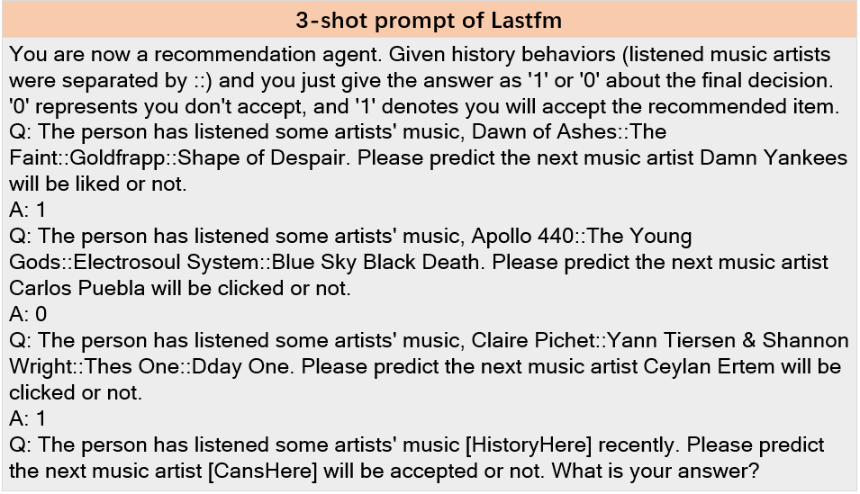
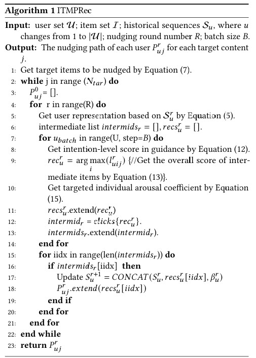

# ITMPRec: Intention-based Targeted Multi-round Proactive Recommendation

Source code for paper: ITMPRec: Intention-based Targeted Multi-round Proactive Recommendation


## Implementation
### Requirements

Python >= 3.8  
Pytorch >= 1.9.0  
tqdm == 4.26.0 
faiss-gpu==1.7.1

### Datasets

Four real-world datasets should be downloaded to the `data` folder.

lastfm: https://grouplens.org/datasets/hetrec-2011/
ml100k: https://grouplens.org/datasets/movielens/100k/
steam: https://cseweb.ucsd.edu/~jmcauley/datasets.html#steam_data
doudan\_movie: https://www.kaggle.com/datasets/fengzhujoey/douban-datasetratingreviewside-information

### Training Model

You can train the models on lastfm, ml100k, steam, and douban_movie datasets in `./src/output` folder by following script. 

```
cd ./src/
python main.py --data_dir ../data/lastfm/ --data_name lastfm  --model_idx 1 --num_intent_clusters 32
```

### Evaluate Model to Generate IoI, and IoR

#### step 1:
You should pre-train GraphAU model to generate initial user/item embeddings, the source code is available in https://github.com/YangLiangwei/GraphAU

#### step 2：
Using following script to evaluate the trained model for getting round-by-round nudging performance:
```
python test_IPG_PreMatch.py --data_dir ../data/lastfm/  --data_name lastfm --num_users 945 --num_items 2782 --model_idx 1 --num_intent_cluster 32

```

### Example of LLM-based User click Simulation 
The 3-shot prompt of Lastfm dataset is as follows:


### The overall algorithm flow of our ITMPRec


